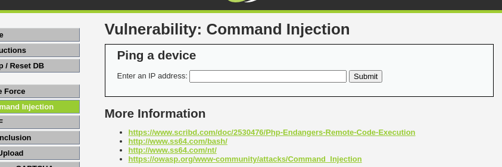
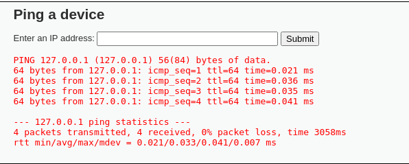
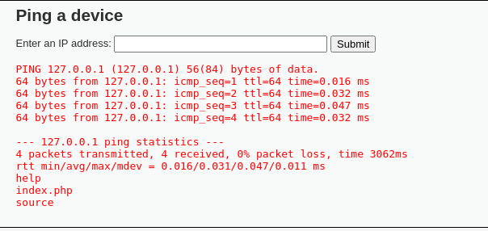
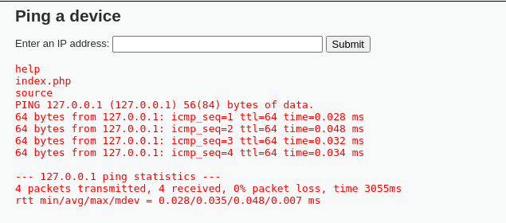

# Command Injection

Mục tiêu là ta sẽ chèn các lệnh shell độc hại để lấy dữ liệu.

**Mức độ: Thấp.**



Đây là giao diện ban đầu của ứng dụng. Ta sẽ nhập vào 1 địa chỉ IP để thực hiện lệnh ping.



Bên trên là giao diện khi ping -> kết quả được trả về -> chưa xuất hiện điều bất thường.

=> Thực hiện thử lệnh ls -> không có kết quả trả về -> chưa xuất hiện điều bất thường. Thế nếu thực hiện cả 2 lệnh thì điều gì xảy ra



Ta có thể thấy ngoài kết kết quả trả về của lệnh ping còn có kết quả của lệnh ls -> liệt kê ra index.php,... -> điều bất thường đã xảy ra

Ta có đoạn code xử lý logic phần submit:

```PHP
<?php
if( isset( $_POST[ 'Submit' ]  ) ) {
    // Get input
    $target = $_REQUEST[ 'ip' ];

    // Determine OS and execute the ping command.
    if( stristr( php_uname( 's' ), 'Windows NT' ) ) {
        // Windows
        $cmd = shell_exec( 'ping  ' . $target );
    }
    else {
        // *nix
        $cmd = shell_exec( 'ping  -c 4 ' . $target );
    }

    // Feedback for the end user
    echo "<pre>{$cmd}</pre>";
}
?>
```

- Đoạn code trên ta thấy ứng dụng nhận vào là 1 địa chị ip
- Nhưng mà lại không có giới hạn nào về giá trị IP nên dễ bị commmand injection.

**Mức độ: Trung bình.**

Thử nhập như mực độ thấp -> không thấy xuất hiện kết quả -> phần code đã được xử lý logic để tránh trường hợp như trên.
=> Thử các ký tự khác trong shell VD: & hoặc |



Ta có thể thấy kết quả hiện thị ra đã có kết quả của câu lệnh ```ls``` -> Các ký tự chưa được lọc hoàn toàn

Ta xem xét sâu vào phần code:
```PHP
<?php
if( isset( $_POST[ 'Submit' ]  ) ) {
    // Get input
    $target = $_REQUEST[ 'ip' ];

    // Set blacklist
    $substitutions = array(
        '&&' => '',
        ';'  => '',
    );

    // Remove any of the characters in the array (blacklist).
    $target = str_replace( array_keys( $substitutions ), $substitutions, $target );

    // Determine OS and execute the ping command.
    if( stristr( php_uname( 's' ), 'Windows NT' ) ) {
        // Windows
        $cmd = shell_exec( 'ping  ' . $target );
    }
    else {
        // *nix
        $cmd = shell_exec( 'ping  -c 4 ' . $target );
    }

    // Feedback for the end user
    echo "<pre>{$cmd}</pre>";
}
?>
```

- Ta có thể nhìn thấy ngay có đoạn black list -> có tác dụng là lọc các ký tự ngắt lệnh nhưng mà vẫn chưa hoàn toàn lọc hết.

**Mức độ: Cao.**

Nhập các câu lệnh như trên -> không ra kết quả -> cũng đã bị fix lỗi.
=> Nhưng khi nhập kí tự || thì vẫn thấy kết quả trả về

Ta xem phần code của mức độ này:

```PHP
<?php
if( isset( $_POST[ 'Submit' ]  ) ) {
    // Get input
    $target = trim($_REQUEST[ 'ip' ]);

    // Set blacklist
    $substitutions = array(
        '&'  => '',
        ';'  => '',
        '| ' => '',
        '-'  => '',
        '$'  => '',
        '('  => '',
        ')'  => '',
        '`'  => '',
        '||' => '',
    );

    // Remove any of the characters in the array (blacklist).
    $target = str_replace( array_keys( $substitutions ), $substitutions, $target );

    // Determine OS and execute the ping command.
    if( stristr( php_uname( 's' ), 'Windows NT' ) ) {
        // Windows
        $cmd = shell_exec( 'ping  ' . $target );
    }
    else {
        // *nix
        $cmd = shell_exec( 'ping  -c 4 ' . $target );
    }

    // Feedback for the end user
    echo "<pre>{$cmd}</pre>";
}
?>
```

- Vẫn như trường hợp của meidum chỉ là sẽ có nhiều ký tự được cho vào blacklist hơn.