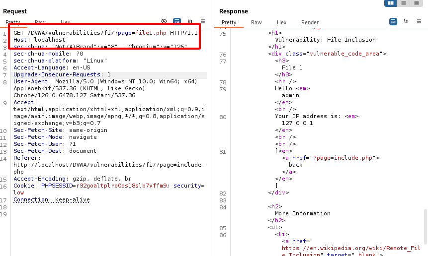
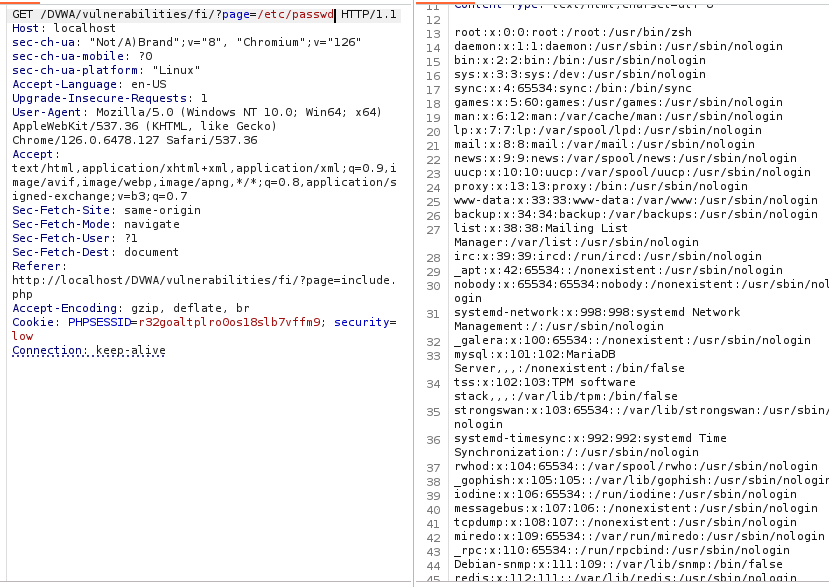
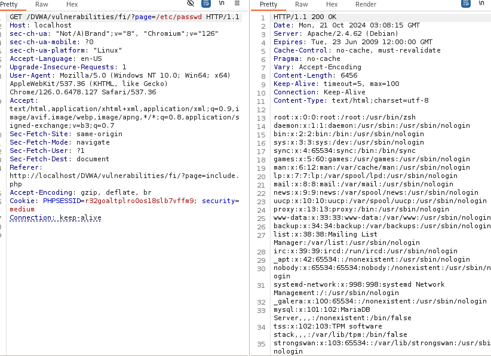
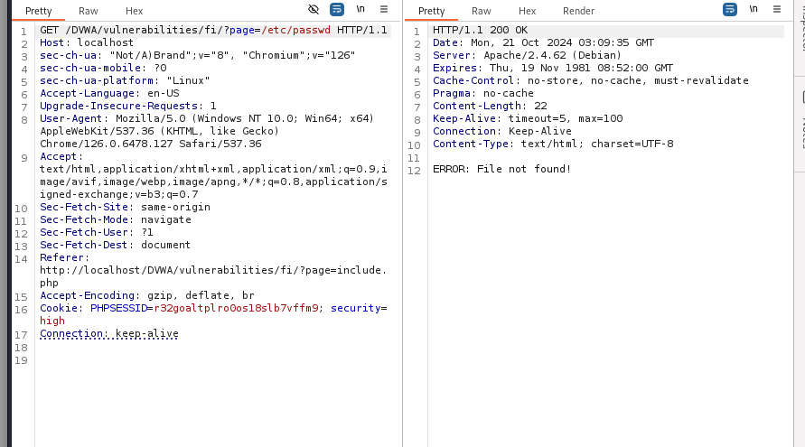
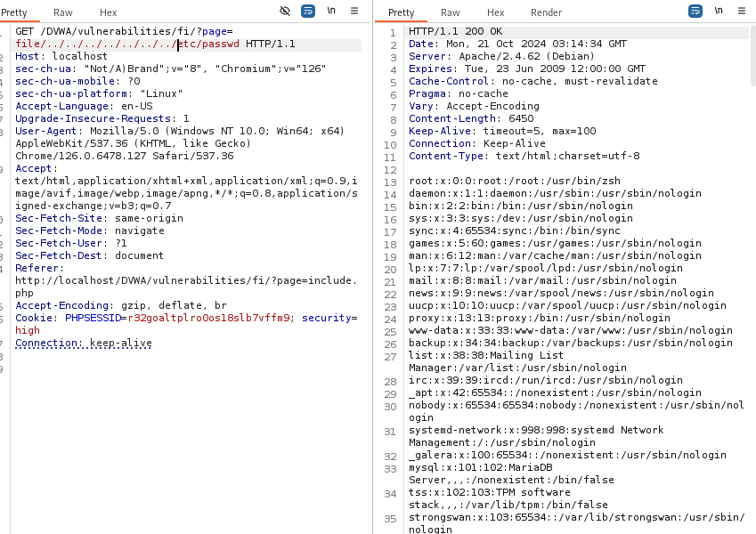

# File Inclusion

Mục tiêu là tìm và đọc được dữ liệu của file nhạy cảm trên server. (file passwd)

**Mức độ: Thấp.**



=> Ta có thể nhìn thấy rằng kiểu đường dẫn để dễ tới file rất đơn giản => Ta thử thay file1 thành /etc/passwd thì thấy trả về luôn kết quả.



**Mức độ: Trung bình.**

Thực hiện như ở mức độ trên cũng trả về kết quả như hình:



**Mức độ: Cao.**

Ở mức độ này nếu ta sử dụng kỹ thuật như ở 2 mức độ kia thì sẽ trả về kết quả lỗi không tìm được file.



=> Cách nhận vào thông tin đường dẫn đã bị fix

Ta tiến hành xem mã code của chương trình:

```PHP
<?php

// The page we wish to display
$file = $_GET[ 'page' ];

// Input validation
if( !fnmatch( "file*", $file ) && $file != "include.php" ) {
    // This isn't the page we want!
    echo "ERROR: File not found!";
    exit;
}

?>
```

- Ta có thể nhìn thấy ngay code xử lý phần này là sử dụng thêm 1 dãy nối string với định dạng là file ở đầu đường dẫn.

=> Từ đó ta thử với dạng đó 

