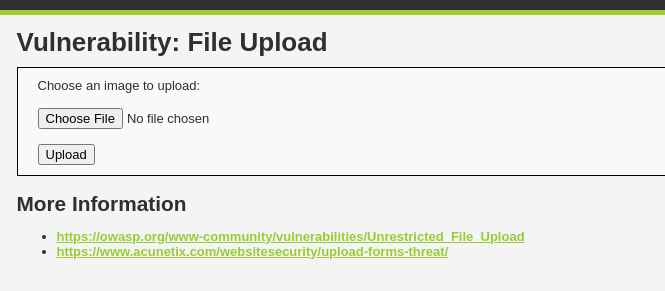
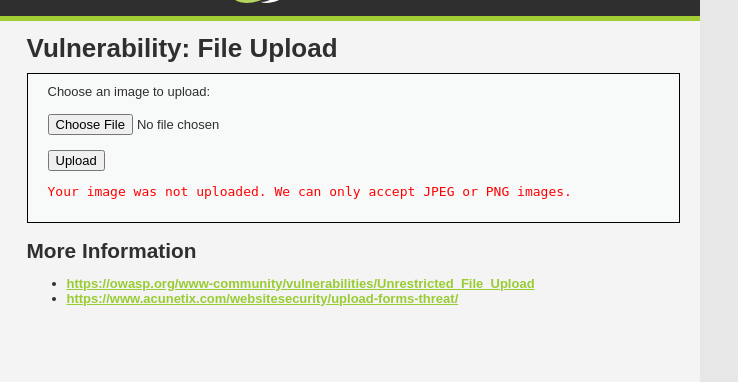

# File Upload

Mục tiêu là ta có thể tải lên 1 file độc hại lên server

**Mức độ: Thấp.**

Đây là giao diện đầu tiên của ứng dụng:



Giao diện cho upload 1 file -> Thực hiện upload 1 file ảnh và bắt request bằng Burp Suite.


- Ta thấy gồm có 2 phần là content-type và phần nội dụng của file.
-> Thay đổi URL để xem ảnh vừa nhập vào:


=> Nếu như thử thay đổi file thành file có đuôi là php -> Chức năng vẫn được thực thi -> Xuất hiện lỗ hổng file upload ở ứng dụng này.

```PHP
<?php
if( isset( $_POST[ 'Upload' ] ) ) {
    // Where are we going to be writing to?
    $target_path = DVWA_WEB_PAGE_TO_ROOT . "hackable/uploads/";
    $target_path = basename( $_FILES[ 'uploaded' ][ 'name' ] );
    // Can we move the file to the upload folder?
    if( !move_uploaded_file( $_FILES[ 'uploaded' ][ 'tmp_name' ], $target_path ) ) {
    // No
        echo '<pre>Your image was not uploaded.</pre>';
    }
    else {
    // Yes!
        echo "<pre>{$target_path} succesfully uploaded!</pre>";
    }
}
?>
```


Kết quả trả về sẽ như sau:


**Mức độ: Trung bình.**

Làm như mức độ dễ thì thấy kết quả trả ra như thế này 


-> Thực hiện thao tác bắt bằng burp suite để xem điều gì đã xảy ra:


Phần content-type không phải là định dạng cho phép. Ta thử xem tới phần code của mức độ:

```PHP
<?php

if( isset( $_POST[ 'Upload' ] ) ) {
    // Where are we going to be writing to?
    $target_path  = DVWA_WEB_PAGE_TO_ROOT . "hackable/uploads/";
    $target_path .= basename( $_FILES[ 'uploaded' ][ 'name' ] );

    // File information
    $uploaded_name = $_FILES[ 'uploaded' ][ 'name' ];
    $uploaded_type = $_FILES[ 'uploaded' ][ 'type' ];
    $uploaded_size = $_FILES[ 'uploaded' ][ 'size' ];

    // Is it an image?
    if( ( $uploaded_type == "image/jpeg" || $uploaded_type == "image/png" ) &&
        ( $uploaded_size < 100000 ) ) {

        // Can we move the file to the upload folder?
        if( !move_uploaded_file( $_FILES[ 'uploaded' ][ 'tmp_name' ], $target_path ) ) {
            // No
            echo '<pre>Your image was not uploaded.</pre>';
        }
        else {
            // Yes!
            echo "<pre>{$target_path} succesfully uploaded!</pre>";
        }
    }
    else {
        // Invalid file
        echo '<pre>Your image was not uploaded. We can only accept JPEG or PNG images.</pre>';
    }
}

?>
```

- Nhìn vào code ta thấy chương trình đã fix cứng chỉ nhận định dạnh là image/jpeg hoặc image/png. -> thử đổi content thành dạng đó xem điều gì xảy ra ?


=> Upload thành công -> lỗ hổng đã xuất hiện.


**Mức độ: Cao.**



Ở mức độ này khi ta upload thì màn trả về kết quả như mức độ trung bình -> có thể thực hiện các bước như mức độ trung bình:


Ta thấy nếu làm như mức độ trung bình thì vẫn trả về kết quả là không thể upload. Ta xem thử phần code của mức độ:

```PHP
<?php

if( isset( $_POST[ 'Upload' ] ) ) {
    // Where are we going to be writing to?
    $target_path  = DVWA_WEB_PAGE_TO_ROOT . "hackable/uploads/";
    $target_path .= basename( $_FILES[ 'uploaded' ][ 'name' ] );

    // File information
    $uploaded_name = $_FILES[ 'uploaded' ][ 'name' ];
    $uploaded_ext  = substr( $uploaded_name, strrpos( $uploaded_name, '.' ) + 1);
    $uploaded_size = $_FILES[ 'uploaded' ][ 'size' ];
    $uploaded_tmp  = $_FILES[ 'uploaded' ][ 'tmp_name' ];

    // Is it an image?
    if( ( strtolower( $uploaded_ext ) == "jpg" || strtolower( $uploaded_ext ) == "jpeg" || strtolower( $uploaded_ext ) == "png" ) &&
        ( $uploaded_size < 100000 ) &&
        getimagesize( $uploaded_tmp ) ) {

        // Can we move the file to the upload folder?
        if( !move_uploaded_file( $uploaded_tmp, $target_path ) ) {
            // No
            echo '<pre>Your image was not uploaded.</pre>';
        }
        else {
            // Yes!
            echo "<pre>{$target_path} succesfully uploaded!</pre>";
        }
    }
    else {
        // Invalid file
        echo '<pre>Your image was not uploaded. We can only accept JPEG or PNG images.</pre>';
    }
}

?>
```
- Ở phần này, đã thực hiện việc thay hoàn toàn trường `$uploaded_type` bằng `$uploaded_ext` → hệ thống sẽ làm việc trực tiếp với phần mở rộng của file → sử MIME như ở trên không có tác dụng
- Dòng `substr( $uploaded_name, strrpos( $uploaded_name, '.' ) + 1)` sẽ lấy trích xuất chuỗi kí  tự đằng sau dấu chấm cuối cùng của chuỗi → lấy phần mở rộng của file


Tuy nhiên khi ta thay đổi đuôi file thành `.jpeg` → vẫn không thể upload được file → có vấn đề nào khác

- Điều kiện `getimagesize($uploaded_tmp)` : để  lấy thông tin về hình ảnh từ tệp được tải lên. Hàm này nhận đường dẫn tới tệp ảnh và trả về một mảng chứa các thông tin như chiều rộng, chiều cao, kiểu MIME,…  → nếu ảnh hợp lệ → TRUE nếu không → FALSE


