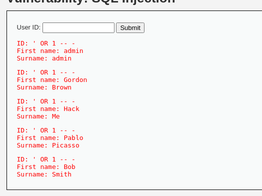

# SQL Injection

Mục tiêu là có thể sử dụng được các payload để lấy được dữ liệu trong server

**Mức độ: Thấp.**

Ta thực hiện nhập 1 giá trị ID bất kì thì có kết quả trả về như sau:


-> Dự đoán là câu lệnh query là :

```SQL
SELECT firstname, surname FROM user WHERE id = ?
```

=> Ta thử nhập vào 1 parameter luôn đúng thì kết quả trả về như thế nào

```SQL
SELECT firstname, surname FROM user WHERE id = ' OR 1 -- -
```

=> Toàn bộ database ở user đã bị show ra -> lỗ hổng đã xuất hiện.



```PHP
<?php

if( isset( $_REQUEST[ 'Submit' ] ) ) {
    // Get input
    $id = $_REQUEST[ 'id' ];

    switch ($_DVWA['SQLI_DB']) {
        case MYSQL:
            // Check database
            $query  = "SELECT first_name, last_name FROM users WHERE user_id = '$id';";
            $result = mysqli_query($GLOBALS["___mysqli_ston"],  $query ) or die( '<pre>' . ((is_object($GLOBALS["___mysqli_ston"])) ? mysqli_error($GLOBALS["___mysqli_ston"]) : (($___mysqli_res = mysqli_connect_error()) ? $___mysqli_res : false)) . '</pre>' );

            // Get results
            while( $row = mysqli_fetch_assoc( $result ) ) {
                // Get values
                $first = $row["first_name"];
                $last  = $row["last_name"];

                // Feedback for end user
                echo "<pre>ID: {$id}<br />First name: {$first}<br />Surname: {$last}</pre>";
            }

            mysqli_close($GLOBALS["___mysqli_ston"]);
            break;
        case SQLITE:
            global $sqlite_db_connection;

            #$sqlite_db_connection = new SQLite3($_DVWA['SQLITE_DB']);
            #$sqlite_db_connection->enableExceptions(true);

            $query  = "SELECT first_name, last_name FROM users WHERE user_id = '$id';";
            #print $query;
            try {
                $results = $sqlite_db_connection->query($query);
            } catch (Exception $e) {
                echo 'Caught exception: ' . $e->getMessage();
                exit();
            }

            if ($results) {
                while ($row = $results->fetchArray()) {
                    // Get values
                    $first = $row["first_name"];
                    $last  = $row["last_name"];

                    // Feedback for end user
                    echo "<pre>ID: {$id}<br />First name: {$first}<br />Surname: {$last}</pre>";
                }
            } else {
                echo "Error in fetch ".$sqlite_db->lastErrorMsg();
            }
            break;
    } 
}

?>
```


Ta có thể thấy luôn là id được truyền trực tiếp vào luôn nên xảy ra lỗ hổng.

**Mức độ: Trung bình.**

```PHP
<?php

if( isset( $_POST[ 'Submit' ] ) ) {
    // Get input
    $id = $_POST[ 'id' ];

    $id = mysqli_real_escape_string($GLOBALS["___mysqli_ston"], $id);

    switch ($_DVWA['SQLI_DB']) {
        case MYSQL:
            $query  = "SELECT first_name, last_name FROM users WHERE user_id = $id;";
            $result = mysqli_query($GLOBALS["___mysqli_ston"], $query) or die( '<pre>' . mysqli_error($GLOBALS["___mysqli_ston"]) . '</pre>' );

            // Get results
            while( $row = mysqli_fetch_assoc( $result ) ) {
                // Display values
                $first = $row["first_name"];
                $last  = $row["last_name"];

                // Feedback for end user
                echo "<pre>ID: {$id}<br />First name: {$first}<br />Surname: {$last}</pre>";
            }
            break;
        case SQLITE:
            global $sqlite_db_connection;

            $query  = "SELECT first_name, last_name FROM users WHERE user_id = $id;";
            #print $query;
            try {
                $results = $sqlite_db_connection->query($query);
            } catch (Exception $e) {
                echo 'Caught exception: ' . $e->getMessage();
                exit();
            }

            if ($results) {
                while ($row = $results->fetchArray()) {
                    // Get values
                    $first = $row["first_name"];
                    $last  = $row["last_name"];

                    // Feedback for end user
                    echo "<pre>ID: {$id}<br />First name: {$first}<br />Surname: {$last}</pre>";
                }
            } else {
                echo "Error in fetch ".$sqlite_db->lastErrorMsg();
            }
            break;
    }
}

// This is used later on in the index.php page
// Setting it here so we can close the database connection in here like in the rest of the source scripts
$query  = "SELECT COUNT(*) FROM users;";
$result = mysqli_query($GLOBALS["___mysqli_ston"],  $query ) or die( '<pre>' . ((is_object($GLOBALS["___mysqli_ston"])) ? mysqli_error($GLOBALS["___mysqli_ston"]) : (($___mysqli_res = mysqli_connect_error()) ? $___mysqli_res : false)) . '</pre>' );
$number_of_rows = mysqli_fetch_row( $result )[0];

mysqli_close($GLOBALS["___mysqli_ston"]);
?>
```

- Ở phần này code đã sử dụng hàm mysqli_real_escape_string để lọc các kí tự  (ASCII 0), \n, \r, \, ', ".

- Ta cần sử dụng burp suite để bắt gói tin và thực hiện attack với các payload -> sử dụng union để tìm ra table


-> Lấy ra tất cả các bảng trong DB


Sử dụng Union để lấy ra mật khẩu


- Ta nhạn thấy mật khẩu đã được mã hóa dưới dạng MD5 -> giải mã thu được mật khẩu của gordon là abc123

